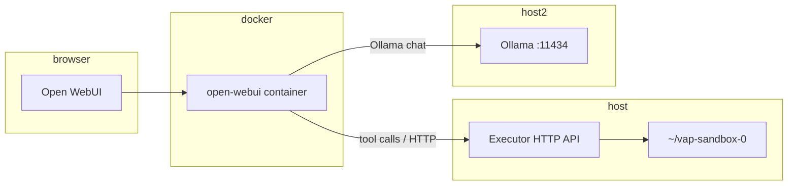

# Phase 4 — Detailed plan (local orchestration from Open WebUI)

**Status:** Planning reference — return here when resuming Phase 4.

**Context:** Open WebUI runs in Docker (`ghcr.io/open-webui/open-webui:main` in `docker-compose.yml`); Ollama runs on the host; sandbox is `~/vap-sandbox-0`. macOS OrbStack with `extra_hosts` for `host.docker.internal` is already in compose.

---

## 1. What “done” means (success criteria)

- From the **WebUI chat**, you can ask something like “list the files in my sandbox” and the thread shows:
  - an **actual tool/API invocation** (not only prose), and  
  - the **real listing** (or a **clear, structured error**).
- All filesystem paths are **confined** to an allow-listed root (start with **`~/vap-sandbox-0`** resolved to an absolute path at startup).
- **Writes** (if any) are **off by default** until you explicitly enable them; **reads/list** first.
- **Secrets** (API token) are not committed; **`.env`** or env vars only.

---

## 2. Target architecture



- **Ollama** stays as today: WebUI → `host.docker.internal:11434`.
- **New piece:** a **small process on the host** listening on `127.0.0.1:<PORT>` (or a dedicated port you firewall).
- **WebUI** must be configured so the **model** can trigger **HTTP** to that executor (via Open WebUI’s **Tools / Functions / OpenAPI** — exact UI names depend on **your Open WebUI version**).

---

## 3. Discovery (before coding)

**Lock your Open WebUI release behavior.** `main` is a moving target; for stability you’ll eventually **pin an image tag** (Phase 5).

1. **Note your running image digest** (or tag) from `docker ps` / `docker inspect open-webui`.
2. **Read upstream docs** for *that* generation for:
   - **External tools / OpenAPI** / **functions** (terminology differs).
   - Whether tools are **OpenAPI 3** imports, **Python functions**, **MCP**, etc.
3. **Decide integration path** (pick one primary path):
   - **Path A — OpenAPI tool** imported into WebUI (if supported): one spec, WebUI calls your host URL.
   - **Path B — WebUI “pipe” / pipeline** (if your version supports calling external HTTP from a pipeline step).
   - **Path C — Thin proxy** only if WebUI cannot call `host.docker.internal` directly: run a **tiny** container in the same compose file that proxies to `http://host.docker.internal:<PORT>`. Prefer **no** extra container if WebUI can reach the host.

**Deliverable:** a short “**WebUI integration note**”: *which feature you use + screenshot or doc link*.

---

## 4. Executor service (what you build)

### 4.1 Responsibilities

- **HTTP JSON API** with **OpenAPI-friendly** routes (helps WebUI import).
- **Auth:** e.g. `Authorization: Bearer <token>` or `X-API-Key` — token from env **only**.
- **Path safety:** single configurable **`SANDBOX_ROOT`** (absolute); reject `..`, symlinks escaping root (or ban symlinks), normalize with `os.path.realpath` under root.
- **Operations (v1 — read-only):**
  - `GET /health` — 200 for smoke tests.
  - `GET /v1/list?path=...` — list names in a directory under root.
  - `GET /v1/read?path=...` — return file contents (size cap, e.g. 1MB).
- **Operations (v2 — later):** `POST /v1/write` with explicit flag + size limits; optional “dry run” mode.

### 4.2 Tech choice

- **Python + FastAPI** fits this repo (Poetry already in `local-ai`); optional `uvicorn` entrypoint.
- Optional: **`executor/`** as a **subproject** with its own minimal `pyproject.toml` to avoid bloating Open Interpreter deps.

### 4.3 Process model

- Run **manually** first: `uvicorn ... --host 127.0.0.1 --port 8787`.
- Later: **launchd** (macOS) or **`scripts/start-local-executor.sh`** — not necessarily `docker compose` unless you add a proxy pattern.

### 4.4 Repo layout (suggested)

- `projects/local-ai/executor/` — `app.py`, dependencies via Poetry or a small nested project.

---

## 5. Networking checklist

| Environment | WebUI → executor |
|---------------|------------------|
| **macOS OrbStack** | Container → `http://host.docker.internal:8787` (`extra_hosts` already on `open-webui`). |
| **Linux** | May need `extra_hosts: host-gateway` or host IP; see `README.md` / `docker-compose.yml` comments. |

**Verify early** with `curl` **from inside** the `open-webui` container:

```bash
docker exec open-webui curl -sS -o /dev/null -w "%{http_code}" http://host.docker.internal:8787/health
```

(Adjust port.) If this fails, fix networking **before** touching models.

---

## 6. Open WebUI wiring (logical steps)

1. **Implement** `/health` + `/v1/list` (read-only).
2. **Publish OpenAPI** JSON (FastAPI: `GET /openapi.json`).
3. **Import / register** in WebUI per **your version’s** docs.
4. **System prompt / tool template** (if applicable): instruct the model to use the sandbox list tool for directory questions.
5. **Model:** use a model that **handles tools** reasonably (often **≥7B** or a known tool-capable model). Very small models (e.g. **0.5b**) may be unreliable for tool calling.

---

## 7. Security (non-negotiables)

- **Bind to `127.0.0.1`** only (not `0.0.0.0`) unless you add TLS + auth and you know why.
- **Token** required on sensitive calls; **read-only** v1 can still use token to avoid casual scanning.
- **No shell** in v1.
- **Logging:** structured logs (path, operation, result code); **no file contents** in logs for sensitive writes.
- **Rate limit** (per IP or global) — even simple token bucket in middleware.

---

## 8. Testing plan (order of execution)

1. **Unit tests:** path canonicalization (symlink, `..`, absolute outside root).
2. **curl from host:** `curl -H "Authorization: Bearer $TOKEN" "http://127.0.0.1:8787/v1/list?path=."`
3. **curl from container:** `docker exec open-webui curl ...` to `host.docker.internal`.
4. **WebUI:** tool appears; **manual** “invoke tool” if the UI supports it.
5. **E2E chat:** one question that **requires** listing; compare output to `ls` on host.

---

## 9. Risks and mitigations

| Risk | Mitigation |
|------|------------|
| Open WebUI `main` changes tool UI | Pin image later; snapshot docs for your version. |
| Model won’t call tools | Stronger model; system prompt; smaller scope (list only). |
| Container can’t reach host | Fix `host.docker.internal` / Linux IP first. |
| Scope creep (full shell) | **Read-only v1**; add writes only after review. |

---

## 10. Documentation to add when implementing

- **`README.md` or `DOCKER.md`:** port, env vars, how to start executor, how to test from container.
- **`.env.example`:** `EXECUTOR_TOKEN`, `EXECUTOR_PORT`, `SANDBOX_ROOT`.
- **`POC.md` Phase 4:** checkboxes for executor + WebUI + E2E.

---

## 11. Suggested execution order (milestones)

1. **Spike** (~½ day): confirm WebUI version + **how** tools are registered (doc + screenshot).
2. **M1 — Executor skeleton:** FastAPI, `127.0.0.1`, `/health`, `/v1/list`, token auth, path sandbox.
3. **M2 — Docker reachability:** `docker exec` curl to `host.docker.internal`.
4. **M3 — WebUI registration:** import OpenAPI / tool; manual test.
5. **M4 — E2E chat:** one reliable “list sandbox” prompt.
6. **M5 — Hardening:** rate limits, logging policy, optional read-only lock for `SANDBOX_ROOT` in config.

---

## 12. Out of scope for first merge

- Arbitrary **shell** execution.
- **Unrestricted** write/delete.
- Running **executor inside** WebUI container **without** mounting host sandbox (avoid until needed).

---

## Related files

- `POC.md` — Phase 4 checklist (high level).
- `docker-compose.yml` — `OLLAMA_BASE_URL`, `extra_hosts` for `host.docker.internal`.
